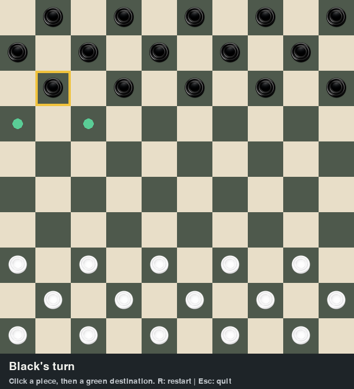

# Checkers / Dame

A local two-player Python/Pygame game, restored from the original game source and piece images.



## Run

Requires Python 3.12 or 3.13. From this folder:

```sh
python -m venv .venv
```

Activate with `.venv\Scripts\activate` on Windows or `source .venv/bin/activate` on macOS/Linux, then:

```sh
python -m pip install -r requirements.txt
python Board.py
```

## Controls and rules

- Black moves first. Click a piece and then a highlighted destination.
- The original layout uses a 10 by 10 board with 15 pieces per side.
- Ordinary pieces move and capture diagonally forward. Captures are mandatory.
- Continue a capture chain with the same piece when another jump is available.
- Reaching the far edge promotes a piece to a short-range king, marked **K**. Promotion ends the turn.
- Kings move one square or capture over one adjacent opponent in either diagonal direction.
- A player wins when their opponent has no pieces or legal moves.
- Press **R** to restart or **Esc** to quit.

This is a custom checkers variant, not full international draughts: it uses three starting rows, short-range kings, forward-only captures for ordinary pieces, and no maximum-capture or draw rule.

## Tests

```sh
python -m unittest -v
```

Rule tests cover movement, turns, captures, capture chains, promotion, and game endings. GitHub Actions also checks that the interface loads the real image assets and renders with a headless display.

## Layout

- `Board.py`: window, input, rendering, and asset loading.
- `game.py`: game rules independent of the display.
- `test_game.py`: rule regression tests.
- `Assets/`: original piece artwork, with normalized filenames.
- `docs/screenshot.png`: screenshot of the game.

## Maintenance

Dependencies are declared in `requirements.in` and locked in `requirements.txt`. To refresh the lock in a Python 3.12 environment, install `pip-tools`, run `pip-compile --upgrade requirements.in`, and rerun the tests.
